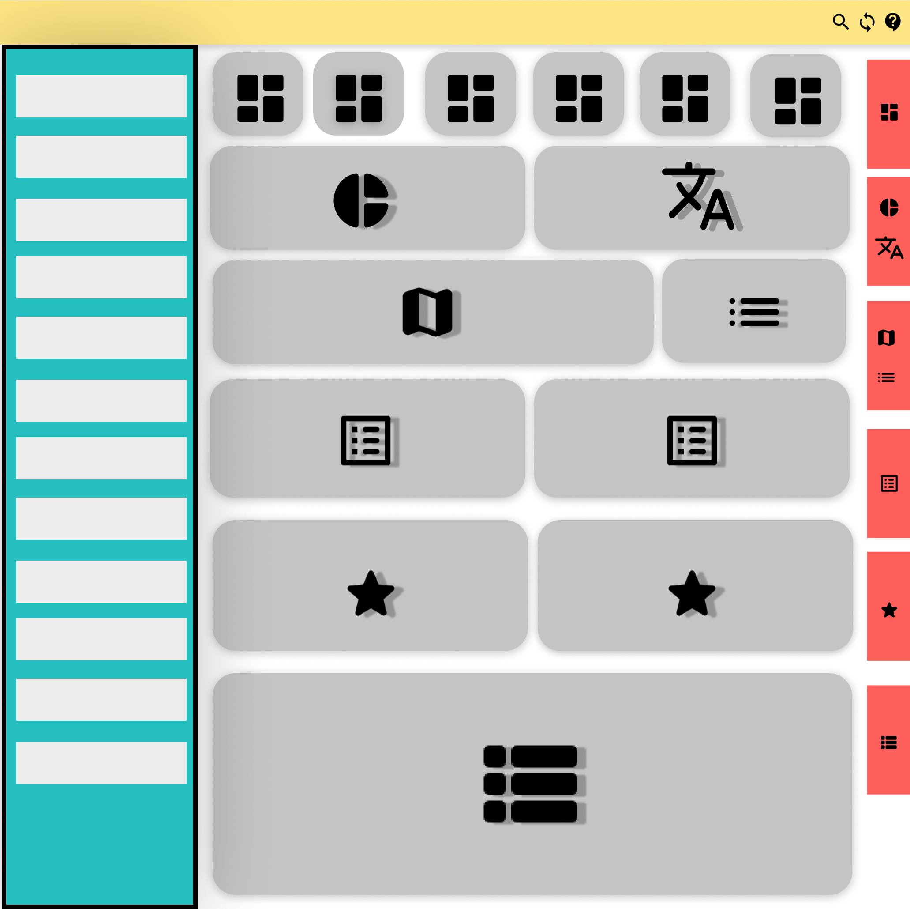
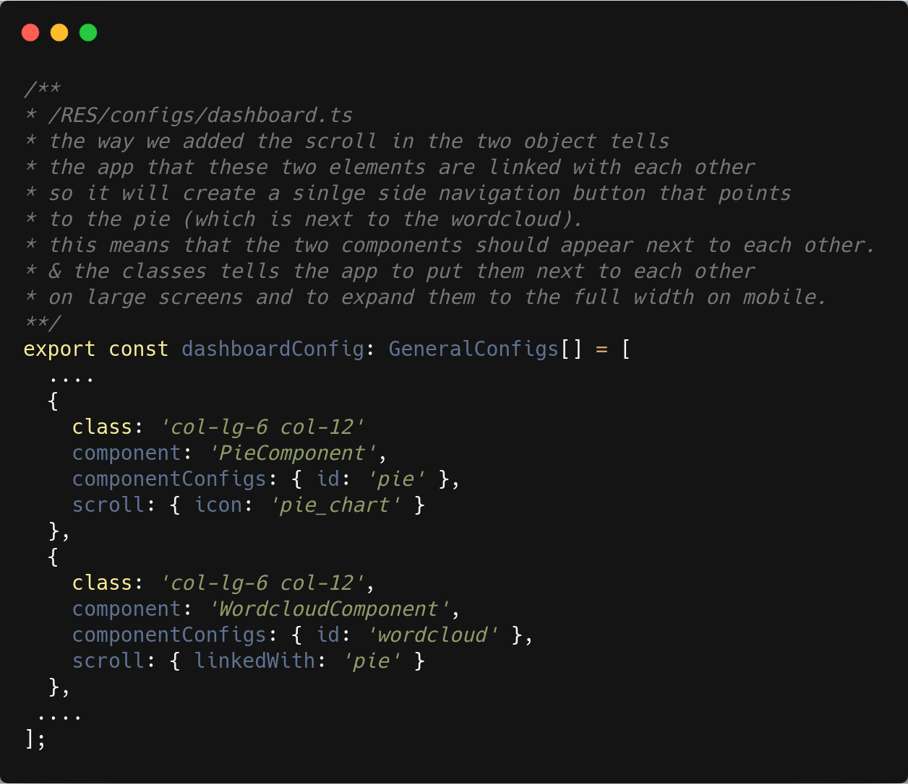
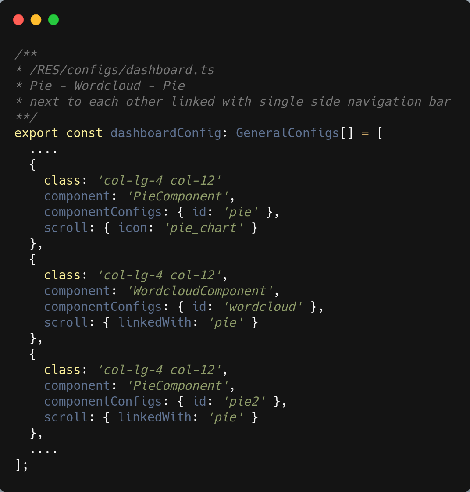
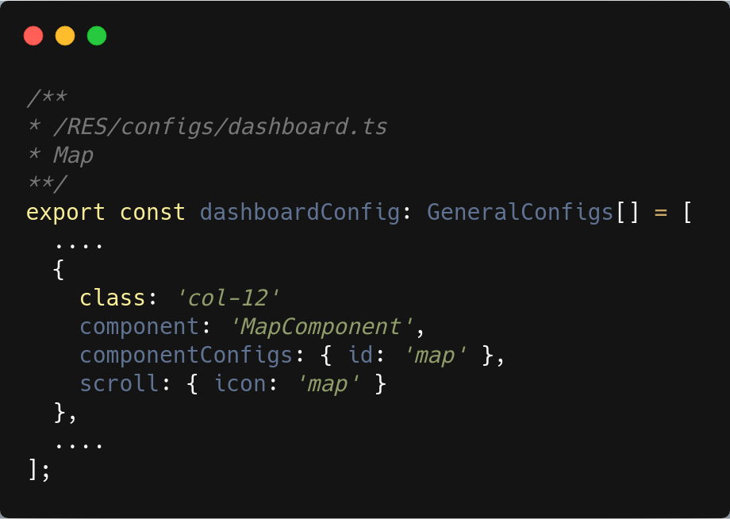
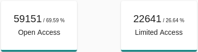
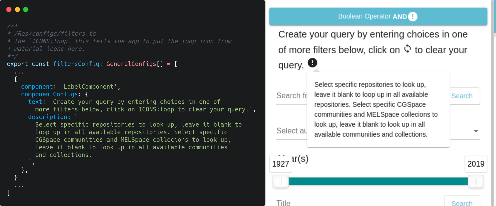
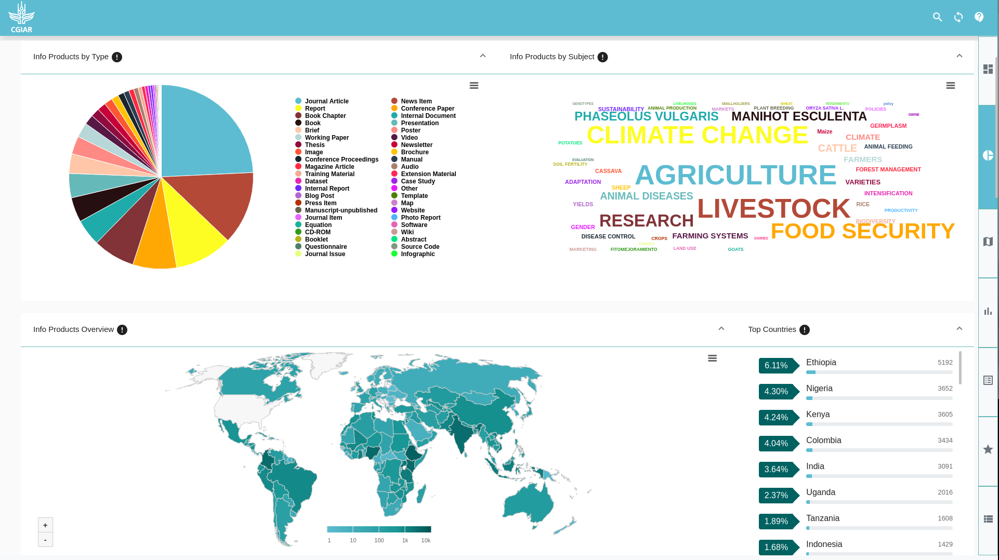

# Open Repository Explorer and Visualizer

  
  

The Open Repository Explorer and Visualizer (OpenRXV) is a dashboard-like tool that was created to help people find and understand content in open access repositories like [DSpace](https://duraspace.org/dspace). It began as a proof of concept developed by [CodeObia](http://codeobia.com/) and [the Monitoring, Evaluation and Learning (MEL)](https://mel.cgiar.org) team at the [International Center for Agricultural Research in the Dry Areas (ICARDA)](https://www.icarda.org) to enable exploring and reporting on content in two key institutional repositories. Later, in partnership with the [International Livestock Research Institute (ILRI)](https://www.ilri.org), the scope was expanded with the idea of supporting more repository types and larger amounts of items. In the future we hope to be able to support any repository that uses Dublin Core metadata and has an API for harvesting.

This project contains a backend indexer powered by [Node.js](https://nodejs.org/) and [Elasticsearch](https://www.elastic.co), and a dynamic frontend built with [Angular](https://angular.io), [Bootstrap](https://getbootstrap.com), [Highcharts](https://www.highcharts.com/), [Angular Material](https://material.angular.io/), and [Ngrx](https://ngrx.io/). The application is wrapped up and deployed via [Docker](https://www.docker.com/). This product includes GeoLite2 data created by MaxMind, available from [https://www.maxmind.com](https://www.maxmind.com).

You can see an example of the project working on our [Agricultural Research e-Seeker (AReS)](https://cgspace.cgiar.org/explorer/).

  

## Requirements

  

- Node.js v8+

  

- npm 5.6.0+

  

- Docker 17.12.0+

  

- docker-compose 1.18.0+

  

-  [dspace-statistics-api](https://github.com/ilri/dspace-statistics-api) (optional, for item views and downloads)

  

## Installation  

#### After you have satisfied the requirements you can clone this repository and build the project:
```console
$ cd docker
$ sudo docker-compose up -d
```  
*Note: the Elasticsearch component requires more virtual memory. You will most likely need to increase the host system's memory map limits by setting `vm.max_map_count = 262144` in /etc/sysctl.conf. See the [Elasticsearch docs for more information](https://www.elastic.co/guide/en/elasticsearch/reference/current/vm-max-map-count.html).*

  
## Configuration

Configuration of repositories and metadata to harvest is in `backend/config/index.json`. Mappings of equivalent metadata values — for example "Kenya" and "KENYA" — are in `backend/config/mapping.json`.

  

## Build and Run  

```console
$ git clone https://github.com/ILRI/AReS.git
$ cd AReS/frontend
$ npm i
$ npm install -g @angular/cli
$ ng build --prod # for building the project in production mode
$ # or
$ ng serve --base-href=/explorer/ # for developing locally
$ cd AReS/app
$ npm i
$ cd AReS
$ sudo chmod 777 -R esConfig/
$ docker-compose up -d
```
## Todo

- Improve documentation (in progress...)

- Add reporting functionality

## Documentation

  

The application is divided into four sections


1 - The navbar ( yellow ) : which holds the logo on the left, and three buttons with icons on the right,

  

-   opens the side filters (the fourth section).

-   clears the query.

-   opens a tutorial ( which is a bunch of popups over the elements in the dashboard ).

  

2 - The components ( gray ): holds the charts and lists:

  

- counters (  ).

- pie (  ) , worldcould (  ), and map (  ) charts.

  

- top counties (  ), top contributors (  ), Top Affiliations (  ), CRPs and Platforms (  ), and Funders lists (  ).

  

- paginated list (  ).

  

3 - The side navigation buttons ( red color ): these buttons navigate the user to the corresponding components with the same icon(s).

  

4 - The Filters ( blue color ): which are multiple inputs that allow you to search and filter the data, which reflects on the charts & lists.

  

<details>

<summary>App structure image ( Click to expand )</summary>



</details>

  

<hr  />

  

Almost everything is configurable, colors, the position of charts, tooltips text, and the data being displayed in the charts.

  

And to change these attributes you need to modify some TypeScript and SCSS files, which you can find in

  

`/RES/src/configs`

  

-  `/counters.ts` {  }
    - Includes the configuration of the **upper section** that display the ‘_number of total items’_, ‘_number of open access documents’_, ‘_number of authors_’, etc.…

  

-  `/dashboard.ts` { , , , , , ,  }

    - Includes the configuration of the **Charts & lists section**, here you can add more charts, rearrange, & delete any chart or list.

  

-  `/filters.ts`


    - Includes the configuration of the **Side Filters**, which you can modify to remove the filter or change the values each filter displays to modify the query.

  

-  `/generalConfig.interface.ts`


    - Just a simple file that **holds types** that will help your _IDE/text editor_ or _you_ to know the options that you can add in the configurations.

  

-  `/tooltips.ts`

    - Currently, this file only holds the text for the tooltip that will be shown when the user hovers over the icon (  ) in the ‘or/and’ button inside the filters area.

  

-  `/chartColors.ts`

  

    - Holds the **colors of the charts** in hexidecimal format.

  

    -  [Good website](https://color.adobe.com/explore) to choose nice colors.

  

    -  [Good website for generating color shades](http://mcg.mbitson.com/).

  

-  `/colorsMap.scss`

  

    - Includes a _sass_ map that holds the **main colors of the whole app**.

  

-  `/customTheme.scss`

  

    - In this file, we make sure that the main color gets applied to all third-party libraries and custom _css_ classes

  

-  `/tour.ts`

  

    - Currently, this file only holds the configuration of a single card that will be displayed as the first part of the **tutorial**, you can modify its text here.

  

    - The rest of the tutorial will be built from the configuration of `counters.ts` & `dashboard.ts`.

  

    - We will take the title and description from each object and use them in the popover on top of the element:

  

    - <details>
        <summary>Tour example ( Click to expand )</summary>
            
        
      </details>

  

### Generic Configurations

  

-  `counters.ts`, `dashbaord.ts`, & `filter.ts` all exports an array of objects ( _type hinted via `./generalConfig.interface.ts/GeneralConfigs`_ ), and each object delegates an element in the web page through a set of properties you might configure.

  

The properties that you can add to each object :

  

- show (_optional_): which determine if we should hide or show the element that this object delegate, this is useful when you write some code for testing and you do not want to remove it.

  

- tour (_optional_): which if you set it to `true`, the app will take the `description` & `title` from this object and adds them to a popover that shows on top of the element that this object delegates. And if you set it to `false` or didn’t even put it, the element that this object delegate won’t be used the tutorial.

  

- component (_optional_ in `counter.ts` ): in the case of the counters you don’t need to add it since each object from this file will delegate a counter component by default, but in the `filters.ts` & `dashboard.ts` you need to add a string of the name of the component. Available components [`SelectComponent`, `LabelComponent`, `CounterComponent`, `SearchComponent`, `RangeComponent`, `ListComponent`, `WelcomeComponent`, `PieComponent`, `WordcloudComponent`, `MapComponent`]

  

- title (_optional_): The text you will add here will be shown as the header for the counters (this will only affect only the counter).

  

- class (_optional_): bootstrap classes that you want the app to use for the current component. we usually use the grid system classes here to organize each component placement ( bootstrap gird wont effect the counters ), _if you added class in the style.scss and add its name here it will work_.

  

- scroll (_optional_): this property is responsible for the side navigation buttons (red), and should be added to the `dashboard.ts` & `counter.ts` objects, and there is a rule you need to keep in mind, in the `counters.ts` you only need to add this property to the first element in the array.

  

- icon (_optional_): the icon will be added to the side navigation buttons, [all icon names](https://material.io/tools/icons/).

- linkedWith (_optional_): if the element has another one next to it(like the map & top countries), we need to add the id of that element here, to tell the app that these two are linked.

examples :
   <details>
      <summary>Two elements next to each other, linked with one side navigation button. ( Click to expand )</summary>

  

</details>
<details>
    <summary>Three elements next to each other, linked with one side navigation button. ( Click to expand )</summary>

  

</details>

<details>
    <summary>One element, with single side navigation button. ( Click to expand )</summary>

  

</details>

-  **componentConfigs (_required_)** : this property may be `ComponentDashboardConfigs`, `ComponentCounterConfigs`, `ComponentLabelConfigs`, `ComponentSearchConfigs`, or`ComponentFilterConfigs`
- ComponentDashboardConfigs - id (_required_): any string you want, but this must be unique. - title (_required_): the title of the popover if this element is used in the tour, also used in the top of the panel that holds the chart . - description (_required_): the body of the popover, if this element is used in the tour.

 - source (_required_): string, the elasticsearch key that this component will get its data from, this might be an array of strings in the case of the bar chart.
	 -  In case of the bar chart the source is an array of two strings, which if you put `['author', 'year']` the app will produce a bar chart of authors by year and two filters the first one is filter by author and the second is filter by year, as same as their order in the array.


- content (_optional_): `PaginatedListConfigs` object which contains the following properties:

	- TODO ....

- ComponentCounterConfigs:

  - id (_required_): any string you want, but this must be unique.

  - title (_required_): the title of the popover if this element is used in the tour.

  - description (_required_): the body of the popover, if this element is used in the tour.

  - source (_required_): string, the elasticsearch key that this component will get its data from, this might be an array of strings in the case of the chart bar.

  - percentageFromTotal (_optional_) : (boolean) should this counter displays a percentage from the total items.

    -  <details>
        <summary>percentage example. ( Click to expand )</summary>

        

</details>

- filter (_optional_): (string) the filter for `open access` or `limited access`.

- ComponentLabelConfigs (this object is used in the side filters ( `filters.ts` ) and delegates a label that separate each section of a filters):

  - text (_required_): what should be displayed

  - border (_optional_): (boolean) should the app put a bottom border under the text?

  - description (_optional_): if you added text here an icon (  ) will show next to the text, and when the user hover over it a popover will the description.

  -  <details>
      <summary>example. ( Click to expand )</summary>
        

</details>

- ComponentSearchConfigs (this object is used in the side filters ( `filters.ts` ) and delegates a search text box that is used to search in a specific key in elasticsearch)

  - placeholder (_required_) : the placeholder in the input.

  - type (_required_) : which is `searchOptions` and could be `titleSearch` or `allSearch`.

  - ComponentFilterConfigs (delegates a multiple select filter):

  - source (_required_): string, the elasticsearch key that this filter will get its data from.

  - placeholder (_required_) : the placeholder in the input.

  - expandPosition (_optional_) : the position that the select options will expand to might be `top` or `bottom`, if you do not provide a position the app will expand the select based on the user view.

  - addInMainQuery (_optional_) : (boolean), the main query that gets called when you first load the page and when you change any filter values takes the `source` property from the configs and build the main query, but there are some `sources` that only needed for the filters. So if this was set to true this source will be used in the main query else it won't. this makes the app faster, hence it dose not load data, unless it needs it.

  

Note about the generic configurations:

  

- If you changed the order of the objects in any of the arrays in `dashboard.ts`, `counters.ts`, & `filters.ts` the order of the element that this object delegates will change according to the new order you gave it

  

### About Colors

  

If you go to `/RES/src/configs/colorsMap.scss` you will find a [scss map](https://sass-lang.com/documentation/values/maps), which contains the pirmary custom colors of the app, and follows the [angular material theming convection](https://material.angular.io/guide/theming), the key `500` is the color that we see often on the page.

  

Change the map with the colors you want (if you commented the original one and uncommented the map under it you will see how the page changes).

  

Changing this map will not change the colors of the charts, to change them go to `/RES/src/configs/chartColors.ts` and you will see multiple exported variables.

  

- selectMapColors (object)

  - hover(string): the color that the app will fill the country that the user hover over it.

- select(object): when the user clicks on a country

  - color(string): the color of the country after the user clicks on it.

  - borderColor(string): the color of the country borders after the user clicks on it.

- axisColorForMap(object): the color countries in the map chart.

  - minColor, midColor, maxColor

  - legendTextColorForPie(string): the color of the text legends in the pie chart.

- LegendNavigationColors(object): these are the colors for the arrows in the pie chart legends

  - activeColor(string): the color that the arrow will be filled if the user can click on it.

  - inactiveColor(string): the color that the arrow will be filled if the user can't click on it

- style(object):

  - color(string): the color of how many pages of legends we have (this might not show on big screens).

  

  - chartValuesColors (array of strings): the colors of the charts (excluding the map), starts from the highest value.

  

we included a file `/RES/src/configs/codeobia.colors.ts` which includes colors that match with the commented scss map, active them both and see how much change happens. ( copy the content of the `codeobia.colors.ts` into `charts.colors.ts` after you deleted every thing in it).

  

### Changing the configurations notes & examples

  

#### Example

  

- swapping the source of the pie and worldcloud charts, and adding a third chart next to them (source country) and making them all linked with the same side navigation button.

- adding full width chart with custom icon on the side navigation buttons (with source 'author').

  

<details>

<summary>Old `image` ( Click to expand )</summary>



</details>

  

<details>

<summary>Old `/RES/src/configs/dashoards.ts` ( Click to expand )</summary>

```ts

export  const  dashboardConfig:  GeneralConfigs[] = [

{

show:  true,

class:  'col-md-6 no-side-padding',

component:  'PieComponent',

componentConfigs:  {

id:  'pie',

title:  'Info Products by Type',

source:  'type',

description:  `....`,

}  as  ComponentDashboardConfigs,

scroll:  {

icon:  'pie_chart',

},

tour:  true,

},

{

class:  'col-md-6 no-side-padding',

show:  true,

component:  'WordcloudComponent',

componentConfigs:  {

id:  'wordcloud',

title:  'Info Products by Subject',

source:  'subject',

description:  `...`,

}  as  ComponentDashboardConfigs,

scroll:  {

linkedWith:  'pie',

},

tour:  true,

},

....

]

```

</details>

  

<details>

<summary>New `image` ( Click to expand )</summary>


</details>

  

<details>

<summary>New `/RES/src/configs/dashoards.ts` ( Click to expand )</summary>

```ts

export  const  dashboardConfig:  GeneralConfigs[] = [

{

show:  true,

class:  'col-md-4 no-side-padding',

component:  'PieComponent',

componentConfigs:  {

id:  'pie',

title:  'Info Products by Type',

source:  'subject',

description:  `...`,

}  as  ComponentDashboardConfigs,

scroll:  {

icon:  'pie_chart',

},

tour:  true,

},

{

class:  'col-md-4 no-side-padding',

show:  true,

component:  'WordcloudComponent',

componentConfigs:  {

id:  'wordcloud',

title:  'Info Products by Subject',

source:  'type',

description:  `...`,

}  as  ComponentDashboardConfigs,

scroll:  {

linkedWith:  'pie',

},

tour:  true,

},

{

class:  'col-md-4 no-side-padding',

show:  true,

component:  'WordcloudComponent',

componentConfigs:  {

id:  'pie2',

title:  'Countries',

source:  'country',

description:  ``,

}  as  ComponentDashboardConfigs,

scroll:  {

linkedWith:  'pie',

},

tour:  true,

},

{

class:  'col-12 no-side-padding',

show:  true,

component:  'PieComponent',

componentConfigs:  {

id:  'pie3',

title:  'Authors',

source:  'author',

description:  ``,

}  as  ComponentDashboardConfigs,

scroll:  {

icon:  'bubble_chart',

},

tour:  true,

},

....

]

```

</details>

  

#### Note

- To change the order of the components and lists in the website.

	- You can change the order of the objects, and their placement in the app will change accordingly.

	-  **BUT** keep in mind the parent object which is the one with `scroll : {icon: 'name'}` should appear as the first one to its children in the array. ( the child has `scroll: {linkedWith: 'parent_id'}` ). - for example in the previous example the pie chart is the parent of the two world cloud components and if you want to change the order of the component you need to keep the pie as the first one ( **but of course you can change the parent to a different chart type or even a list** ).
	
	- for example in the previous example the pie chart is the parent of the two world cloud components and if you want to change the order of the component you need to keep the pie as the first one ( **but of course you can change the parent to a different chart type or even a list** ).

  

## License

  

This work is licensed under the [GPLv3](https://www.gnu.org/licenses/gpl-3.0.en.html). The license allows you to use and modify the work for personal and commercial purposes, but if you distribute the work you must provide users with a means to access the source code for the version you are distributing. Read more about the [GPLv3 at TL;DR Legal](<https://tldrlegal.com/license/gnu-general-public-license-v3-(gpl-3)>).

  

Read more about ILRI's commitment to openness click [here](https://www.ilri.org/open).
